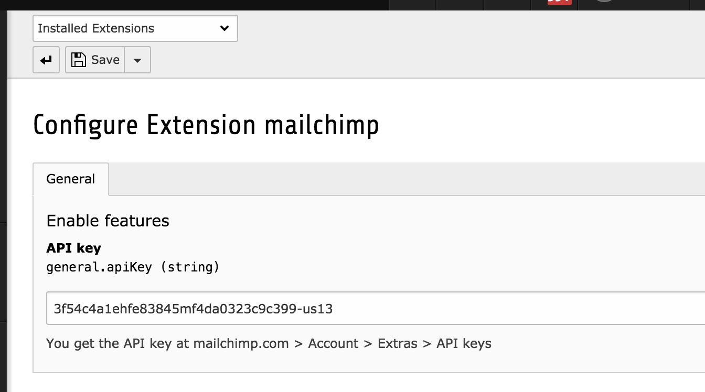

.. ==================================================
.. FOR YOUR INFORMATION
.. --------------------------------------------------
.. -*- coding: utf-8 -*- with BOM.

.. include:: ../Includes.txt

Installation
============

**Installation**

This extension can be installed like any regular TYPO3 extension:

- Use the Extension Manager to download the extension
- Use composer with `composer require sup7even/mailchimp`.

**API key**

After the login at http://www.mailchimp.com switch to *Profile* > *Extras* > *API keys*. Press the button *Create API key* and save the key for later.

After activating the extension in the Extension Manager, you need to provide the key in the settings.

Since version *3.0.0* it is possible to use multiple MailChimp accounts within one TYPO3 installation by providing the keys in the following syntax: ::

   # key:label,key:label,key:label
   # Label can be any string or LLL:EXT:sitepackage/locallang.xlf:mailchimp-account1
   28a11212ad15f7da4048efe871c6-us13:Account1,quqw81278qwnjqw812mqw0-us16:Account2
