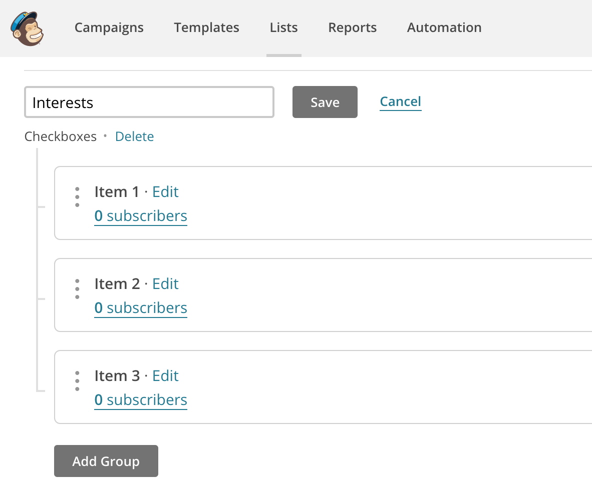
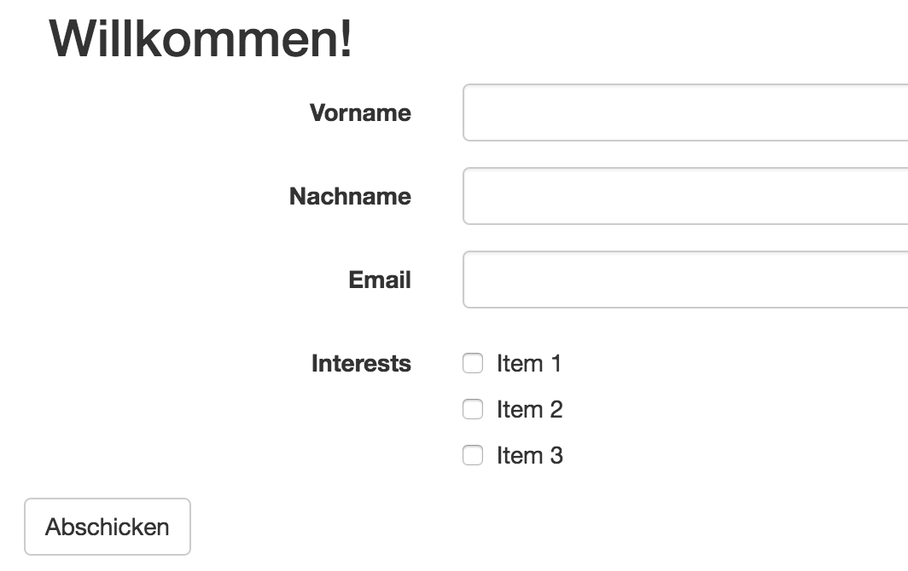
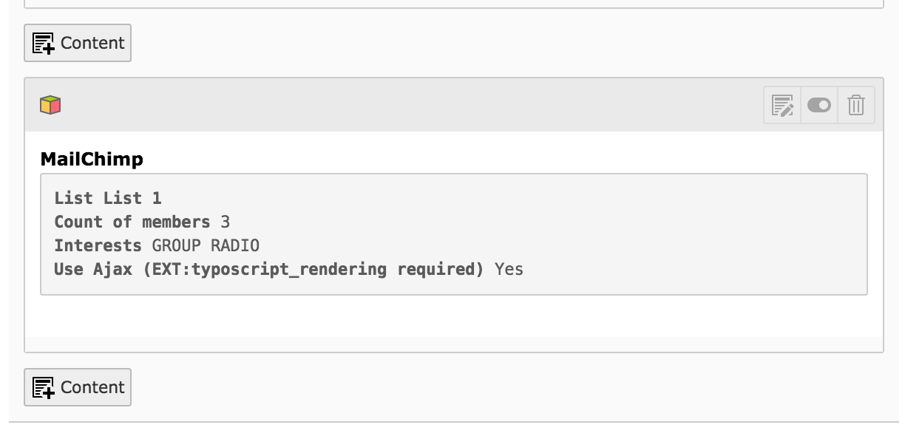

.. ==================================================
.. FOR YOUR INFORMATION
.. --------------------------------------------------
.. -*- coding: utf-8 -*- with BOM.

.. include:: ../Includes.txt

What does it do?
================

This extension enables users of your website to subscribe to your MailChimp lists.

- The template is fully under your control by using fluid
- Usage of all variants of interest groups
- No sync jobs or something like that needed
- Ajax usage (if EXT:typoscript_rendering is installed)

	Simple list in MailChimp

	Simple form rendered in TYPO3

    	The page module shows all settings and the count of people subscribed to the selected list

Requirements
------------

The requirements are low:

- TYPO3 CMS 6.2 - 8.2
- PHP 5.5 - 7
- MailChimp API key

About us
--------

Author of this extension is the company **supseven**.

    	http://www.supseven.at

Issue tracking & development
----------------------------

If you have found any bugs or missing features, please create an issue at https://github.com/sup7even/mailchimp/issues.

The UnitTests can be started by using

.. code-block:: bash

    ./typo3_src/bin/phpunit -c ./typo3/sysext/core/Build/UnitTests.xml ./typo3conf/ext/mailchimp/Tests/

Every build is checked by using https://travis-ci.org/sup7even/mailchimp.

License
-------

This extension is published under GPL2 license.
