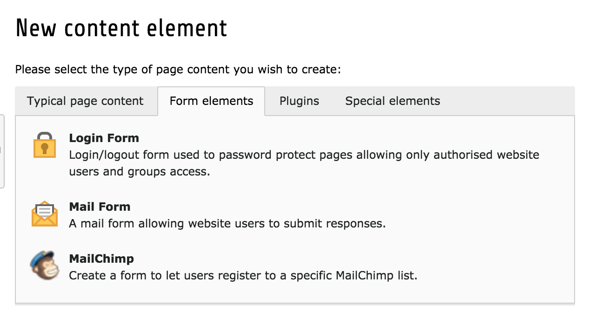
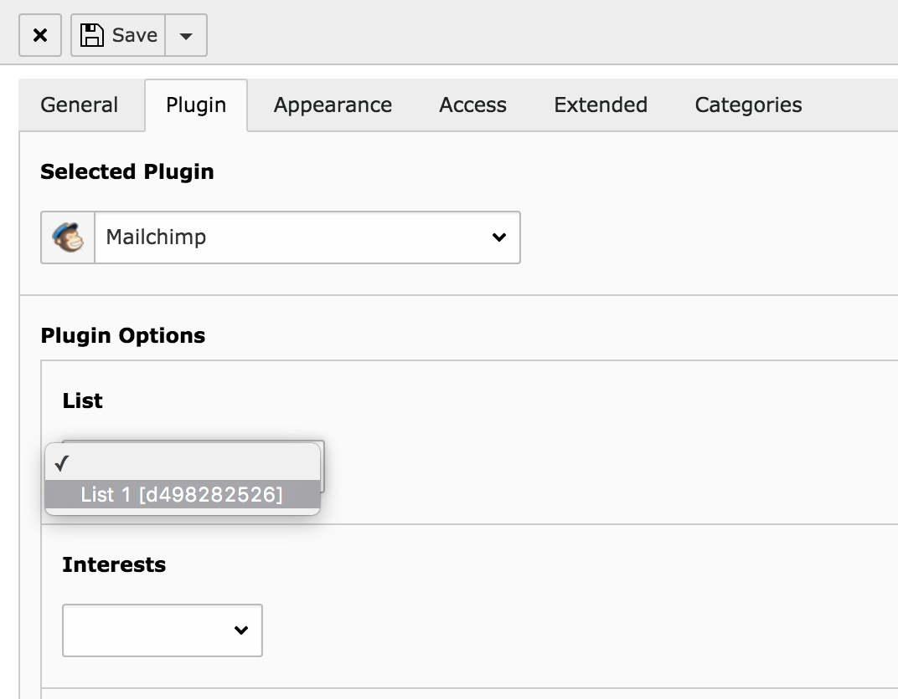
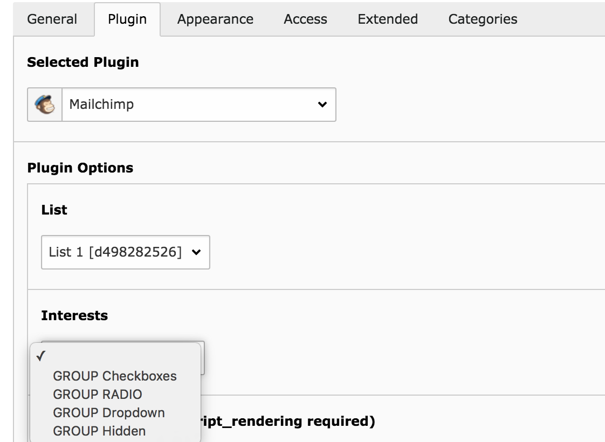

.. ==================================================
.. FOR YOUR INFORMATION
.. --------------------------------------------------
.. -*- coding: utf-8 -*- with BOM.

.. include:: ../Includes.txt

.. _users-manual:

Users manual
============

Create a list at MailChimp
--------------------------

If you have already created a list at mailchimp.com, you can skip this section, otherwise please follow it.

1) Login at https://www.mailchimp.com.
2) Switch to *List*.
3) Press the button *Create List* and fill out the form. All data can be changed later on.

Interest group
^^^^^^^^^^^^^^

Interest groups allow people to subscribe to different topics which can be used later on to send different newsletters. Those topics are called **Intererst Groups**. The creation is really simple:

1) Login at https://www.mailchimp.com.
2) Switch to *List* and select the list you want to create interest groups.
3) Select *Manage Subscribers* > *Groups*.
4) Press the button *Create Groups* to create a group and add as many groups as you need.

.. important:: The type (checkbox, radio button, dropdown) can not be changed later!

Create a mailChimp subscription form
------------------------------------

After the installation, you are able to create a subscription form on any TYPO3 page.

1) Press the ``+`` icon at the page module.
2) Switch to the tab *Form elements* and select *MailChimp*.

3) Select any MailChimp list you want people subscribe to.

4) Optionally select an *interest group*.

**You are done!**